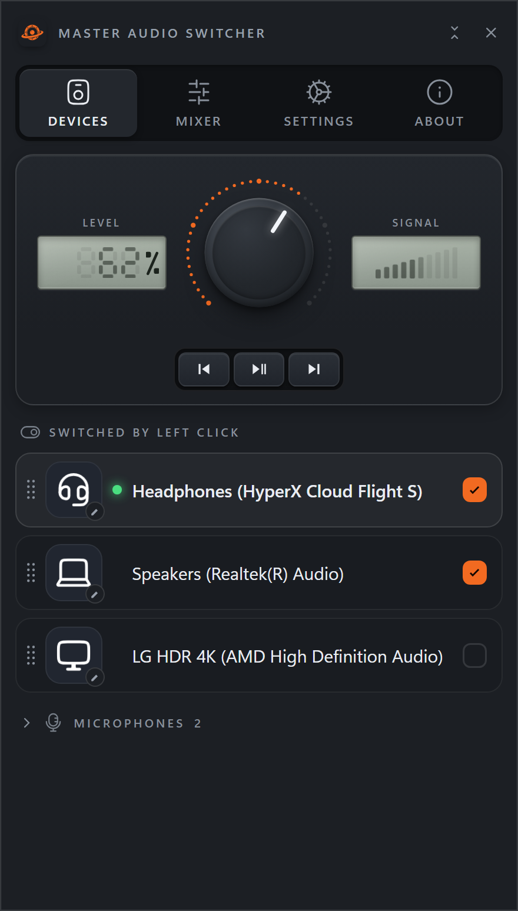
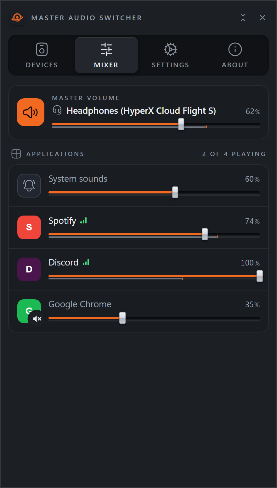
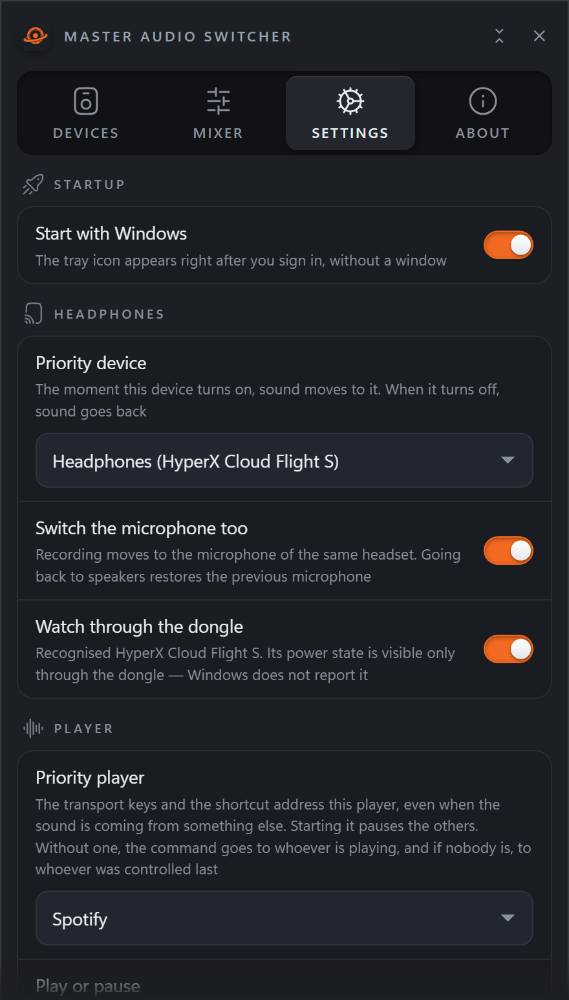
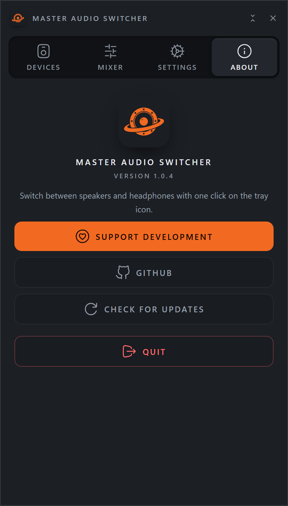

# Master Audio Switcher

A tray utility for Windows that switches audio between speakers and
headphones with one click on the tray icon.



## What it does

- **One click on the tray icon** cycles through the devices you marked.
- **Priority device.** The moment a chosen device appears, sound moves to it.
  When it goes away, sound returns to where it was.
- **Wireless headsets that Windows cannot see.** A headset on a USB dongle keeps
  its audio endpoint alive whether it is powered on or off, so Windows never
  reports the change. Master Audio Switcher reads the dongle's own status report
  over HID — read-only, nothing is ever written to the device.
- **Volume mixer** with per-application levels.
- **Media keys** for the player that is actually in front.
- **A global hotkey** that works over a fullscreen game.
- **A microphone follows its headset**, and comes back when you switch away.

Nothing is sent anywhere. No telemetry, no accounts, no network calls except an
explicit check for a newer release.

## Screenshots

| Mixer | Settings | About |
|---|---|---|
|  |  |  |

Light theme, the welcome screen and the rest are in [docs/screens](docs/screens).

## Install

Get the installer or the archive from
[Releases](https://github.com/electronic-mars/mas/releases/latest). The installer
is per user and needs no administrator rights.

The program is not code-signed, so Windows SmartScreen will warn about it:
**More info → Run anyway**. Every release carries `SHA256SUMS.txt`, and the
binaries are built in public by
[this workflow](https://github.com/electronic-mars/mas/actions) — you can check
what went into them. If an antivirus objects, that is a false positive worth
reporting to them; an unsigned program that synthesises keystrokes and reads HID
looks alarming to a heuristic, and there is nothing to be done about that short
of a paid certificate.

## Updating

**About → Check for updates.** It fetches the new installer, checks it and
restarts the program. Nothing happens without that press: there is no
background checking, and no version of this program contacts anything on its
own.

The check is a signature, not a checksum. Each release is signed on the build
server with a key that exists only in this repository's secrets, and the
program carries the public half compiled into it. An installer that key did not
sign is deleted rather than run — so nobody who does not hold the private key
can hand a running copy an executable, whatever they manage to put in front of
it. Windows does the checking, through its own CNG; there is no cryptography
written here.

If you installed from the Microsoft Store, there is no button: the Store brings
updates on its own, and it does it better. Same program, same build — it asks
Windows which of the two it is.

## Requirements

- Windows 11 (Windows 10 should work; less tested)
- [WebView2 runtime](https://developer.microsoft.com/microsoft-edge/webview2/) —
  present on Windows 11 by default

## Running from source

```
python -m venv .venv
.venv\Scripts\pip install -r requirements.txt
.venv\Scripts\python -m mas
```

Building the executable:

```
.venv\Scripts\pyinstaller build\mas.spec --distpath build\mas --workpath build\work
```

Note: PyInstaller does not re-embed the application icon when only the `.ico`
changes. Delete `build\work` first, or you will ship the previous icon.

Tests:

```
.venv\Scripts\python tests\test_smoke.py
.venv\Scripts\python tests\test_device_icons.py
```

## Wireless headsets

One dongle is recognised out of the box: **HyperX Cloud Flight S** (`0951:16EA`).

Any other one the program works out for itself. Settings → Diagnostics → Teach
this dongle asks you to switch the headset on and off twice, watches what the
dongle says each time, and finds the byte that changes with it. Two cycles and
not one, because a battery reading also differs between a single on and a single
off — and a byte that only looked like the state would mean headphones seizing
the sound at random.

The answer is saved on your machine and takes effect immediately: no release to
wait for. It is not sent anywhere. At the end there is a button that opens a
report already filled in, and pressing it is what adds your headset to the next
version for everyone else who owns one — but that press is yours to make.

## Languages

Fifteen: English, Russian, Ukrainian, German, Spanish, French, Italian,
Portuguese, Polish, Czech, Dutch, Turkish, Chinese, Japanese, Korean.

English, Russian and Ukrainian are written by hand. The rest are machine
translated and then checked — corrections are very welcome, and they are the
easiest thing to contribute: the strings are one JSON file per language in
`src/mas/ui/locales/`, and adding a language is dropping a file in.

`tools/translate_locales.py` fills in what is missing from the English source;
it needs a `DEEPSEEK_API_KEY` and sends only the keys a language does not have
yet.

## Contributing

Fixing a translation is the easiest and most useful thing to do — see
[CONTRIBUTING.md](CONTRIBUTING.md), which also explains how to get a wireless
headset added.

## Privacy

Nothing is collected and nothing is sent. The details, including what the log
contains before you attach it to a bug report, are in [PRIVACY.md](PRIVACY.md).

## License

GPL-3.0-or-later. See [LICENSE](LICENSE).

Third-party components and their licenses: [THIRD-PARTY.md](THIRD-PARTY.md).
Icons are from the free [Hugeicons](https://hugeicons.com) set (MIT).
